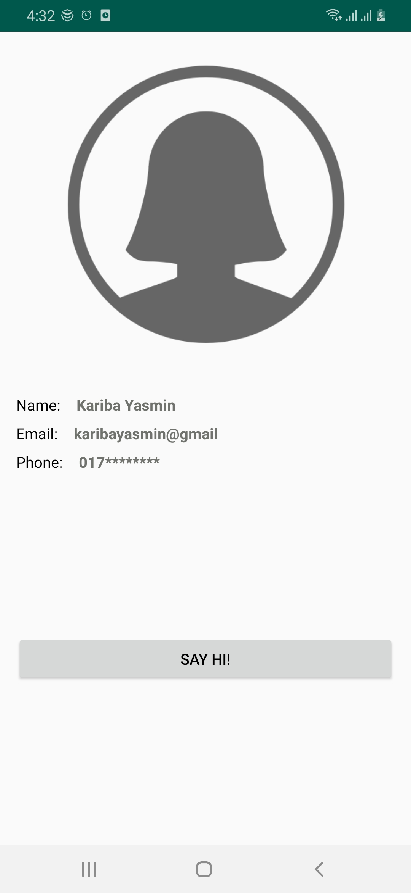
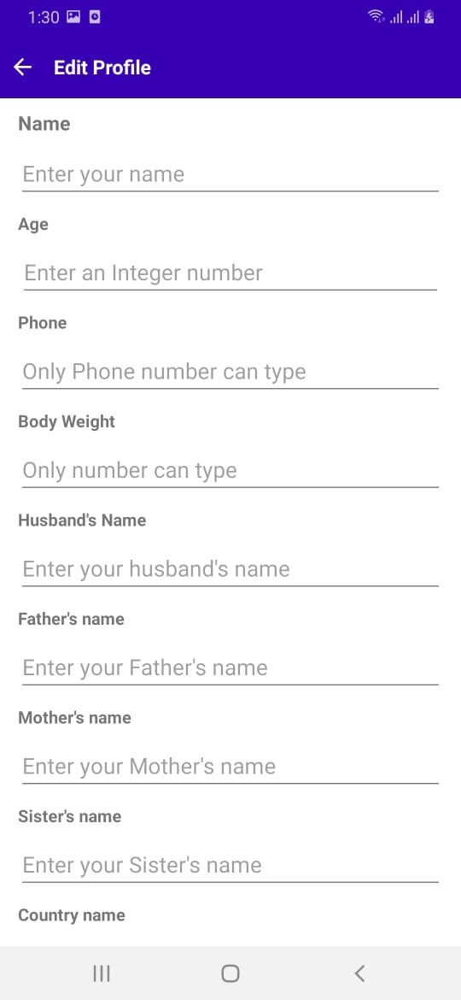
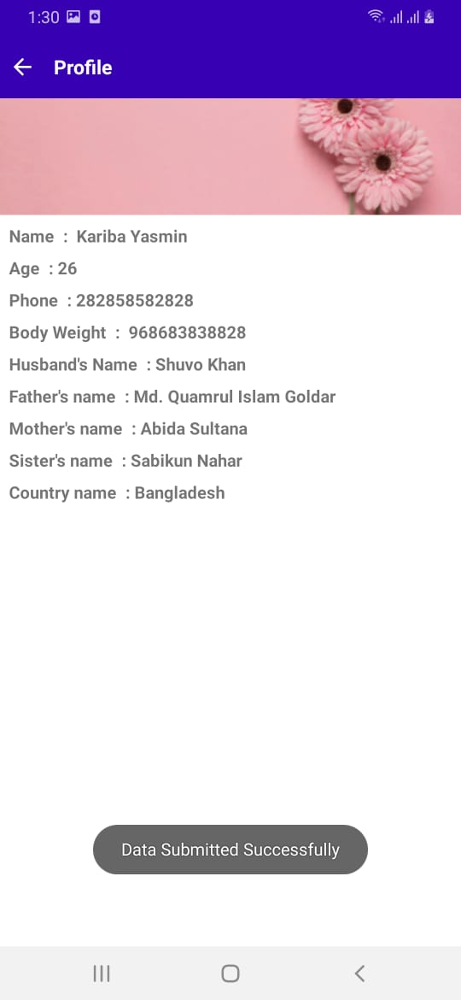

## I have completed an wonderful Native Android App training, taken by Hasan Abdullah vaia.
## Here is the training link https://hellohasan.com/android-course-bangladesh/
### I am uploading here all of my assignments, test, and class practice regarding this training, gradually one after another by completing as my level best.

# This is my First assignment snapshot

  

# This is my second assignment snapshot

  
   
  

